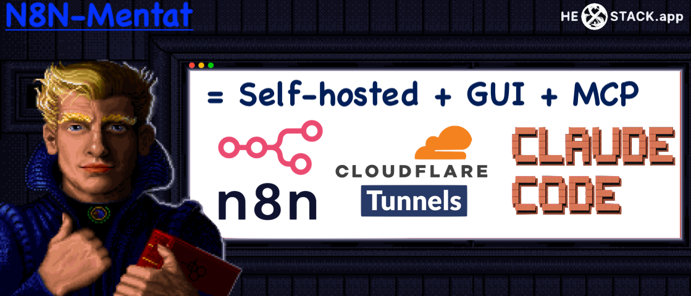

# N8N-Mentat: self-hosted local N8N with GUI, cloudflare tunnel exposure to domain, claude code MCP-server

| Features implemented | Pains solved |
|------|------|
| Website | [Open](https://example.com) |
| Docs | [Read](https://example.com/docs) |

## Features
| **🆓FREE:** Get started when just opened app! Single GUI, single app window. Data stored locally |  |
|------|------|
| **🌟PRO:** Expose the local running N8N to your domain via Cloudflare tunnel in 3-clicks GUI |  |
| **🌟PRO:** Setup and run MCP server for Your Claude code in 2 clicks and |  |

